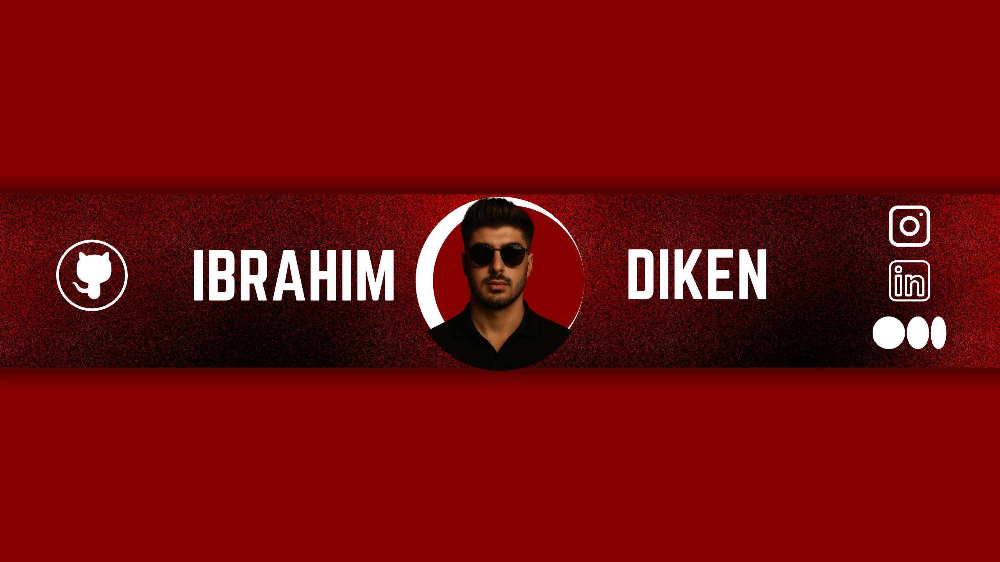

<!-- Profil Banner -->

  

<h1 align="center">
  
</h1>

---

## 💡 Hakkımda

Merhaba! Ben **İbrahim Diken** – yapay zeka tutkunu, yazılım geliştirici ve [ibrilay.digital](https://www.instagram.com/ibrilaydigital/) kurucusuyum.  

- 🎓 Yönetim Bilişim Sistemleri öğrencisiyim  
- 🤖 AI & LLM projeleri geliştiriyorum (Ollama, Hugging Face, Python)  
- 💻 Açık kaynak aşığıyım  
- 📸 Sosyal medyada yazılımı eğlenceli hale getiriyorum  
- ✉️ Bana ulaşmak için: [devibrahim@gmail.com](mailto:devibrahim@gmail.com)

---

## 🏆 Öne Çıkan Projelerim

  
  

---

## ⚙️ Uzmanlıklarım

- Python • Flask • HTML/CSS  
- Hugging Face • Ollama • AI/LLM  
- VS Code • Git & GitHub  
- ChatGPT Prompt Engineering  
- Eğitim teknolojileri ve içerik üretimi

---

## 🔗 Linklerim

[🔗 Instagram](https://www.instagram.com/devibrahimdiken/) •  
[🔗 LinkedIn](https://www.linkedin.com/in/ibrahim-diken/) •  
[🔗 Medium](https://medium.com/@devibrahimdiken)

---

## 🌌 Not

> Bu profil, karanlıkta parlayan yıldızlar gibi büyümeyi hedefleyen bir yazılımcının hikâyesidir ✨